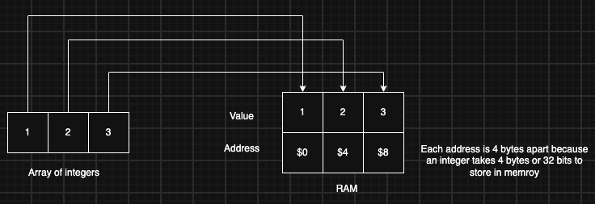
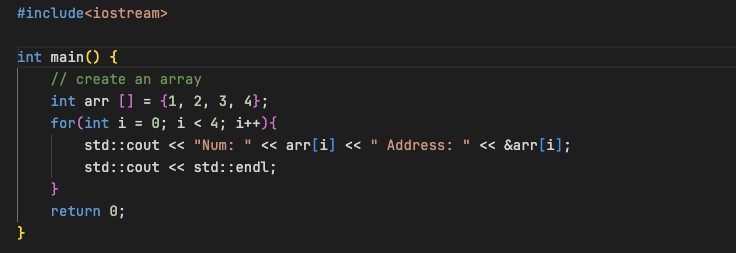
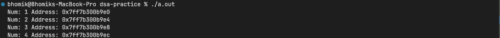

# dsa-practice

Practicing data structures and algorithms alongside the [NeetCode](https://neetcode.io/) course. This repo holds from-scratch implementations, problem solutions, and study notes with complexity analysis.

## Structure

- `data-structures/`: from-scratch implementations (arrays, stack, etc.)
- `problems/`: solutions organized by NeetCode roadmap category

## Progress

| Topic | Category | Status | Link |
|---|---|---|---|
| Static arrays | Data structures | ✅ Done | [static_arrays.py](data-structures/arrays/static_arrays.py) |

## Notes

### RAM

Before we get into this, we need to understand what a data structure is.

Data structures are a way to organise the data in an efficient manner inside a computer component called `RAM`. RAM stands for Random Access Memory - which means we can randomly access any block of memory in constant time `O(1)`.

An array is an ordered collection of contiguous elements, for example `[1, 3, 5]`. An `address` and `value` gets associated with an integer upon storing it in the RAM. An address is just a distinct location where each one of the values is stored at. Most commonly, an integer takes about 4 bytes of memory (32 bits) and on the other hand, a char only take about 1 byte of memory (8 bits). A bit is a fundamental unit of memory which can either store 0 or 1.

Some numbers:

```
1 GB → 1024 megabytes
1 MB → 1024 kilobytes
1 KB → 1024 bytes
1 byte → 8 bits
```

```
1 → 0001 (representation of 1 in 4bits)
2 → 0010 (representation of 2 in 4bits)
```



Printing the array of integers and their addresses in C++. Each address is 4 bytes apart.





### Static Arrays

In statically typed languages like C++ and Java, arrays have to have an allocated size and type when initialised. These are called static arrays. Once the array is full, it cannot store additional elements into it. On the other hand, dynamic arrays can change their size during the runtime and can store additional elements. In programming languages like Python and Javascript, we don't have any static arrays, there are only dynamic arrays.

#### Time complexity

| Operation | Big-O Time | Notes |
|---|---|---|
| Reading | O(1) | |
| Insertion | O(n)* | If inserting at the end, O(1) |
| Deletion | O(n)* | If deleting at the end, O(1) |
